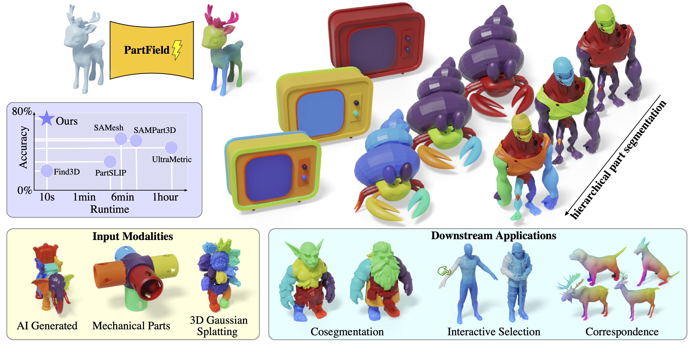
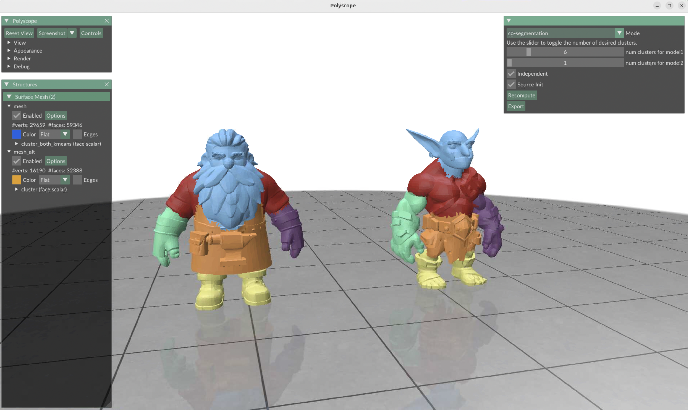
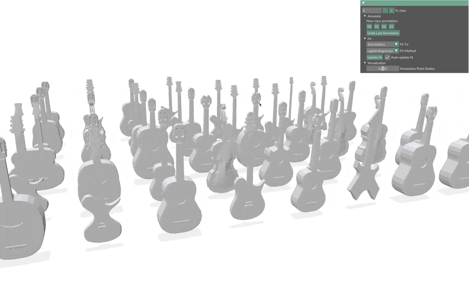
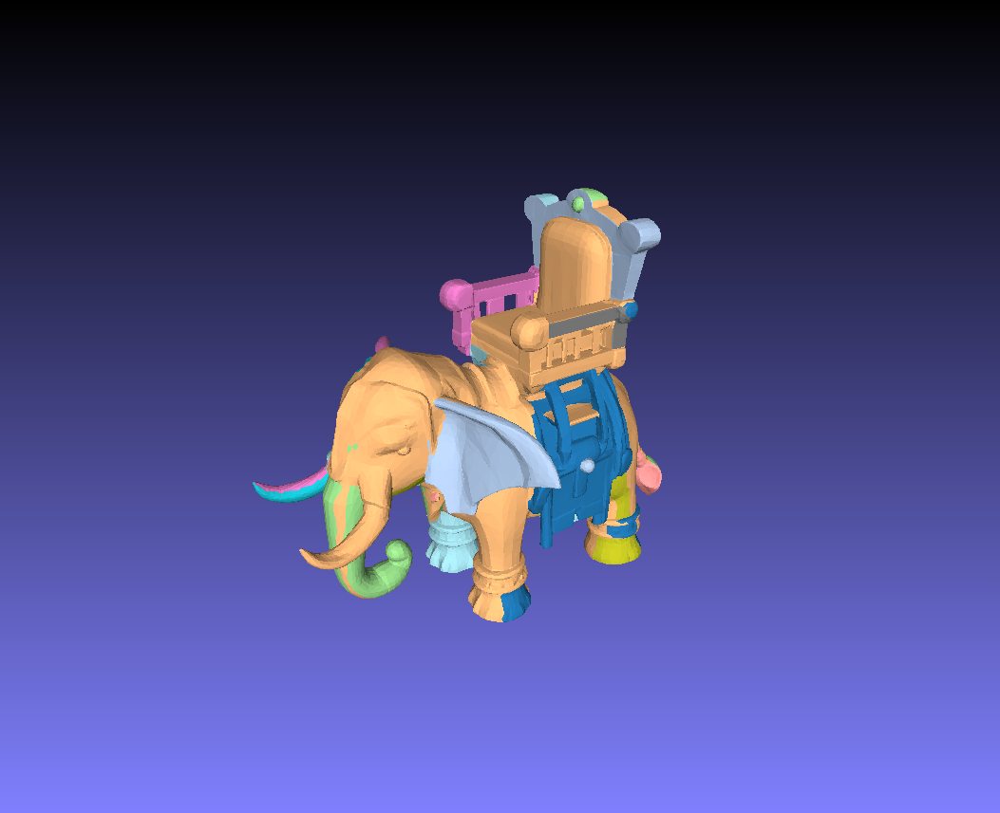
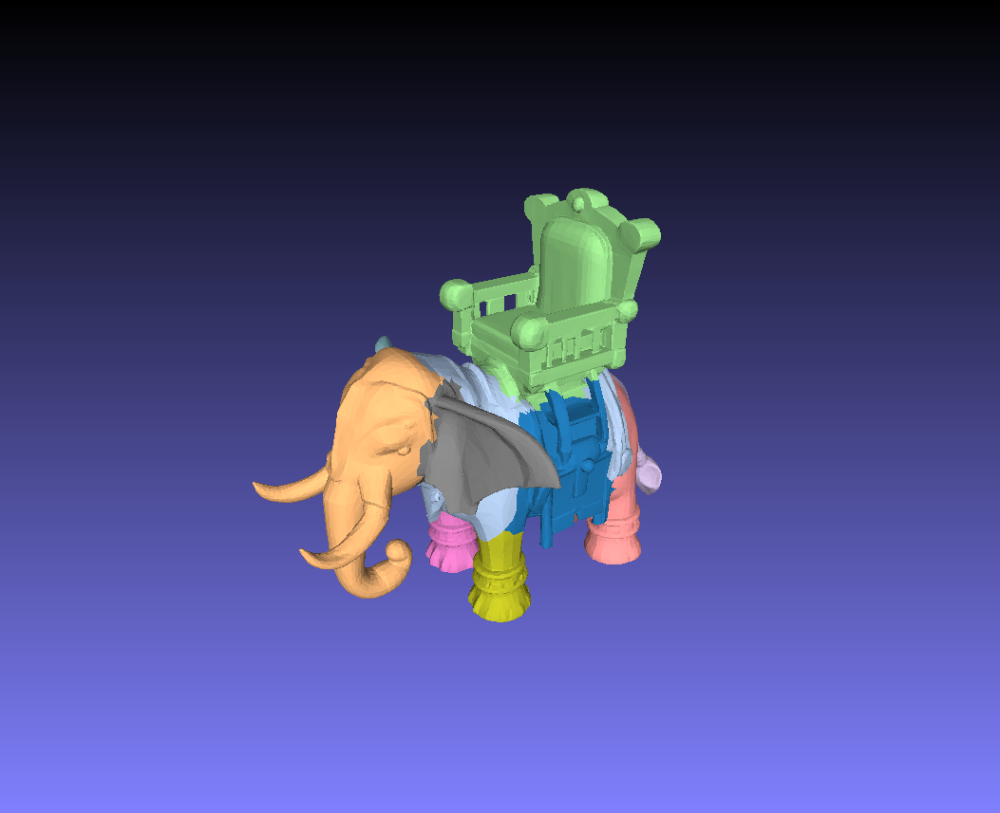
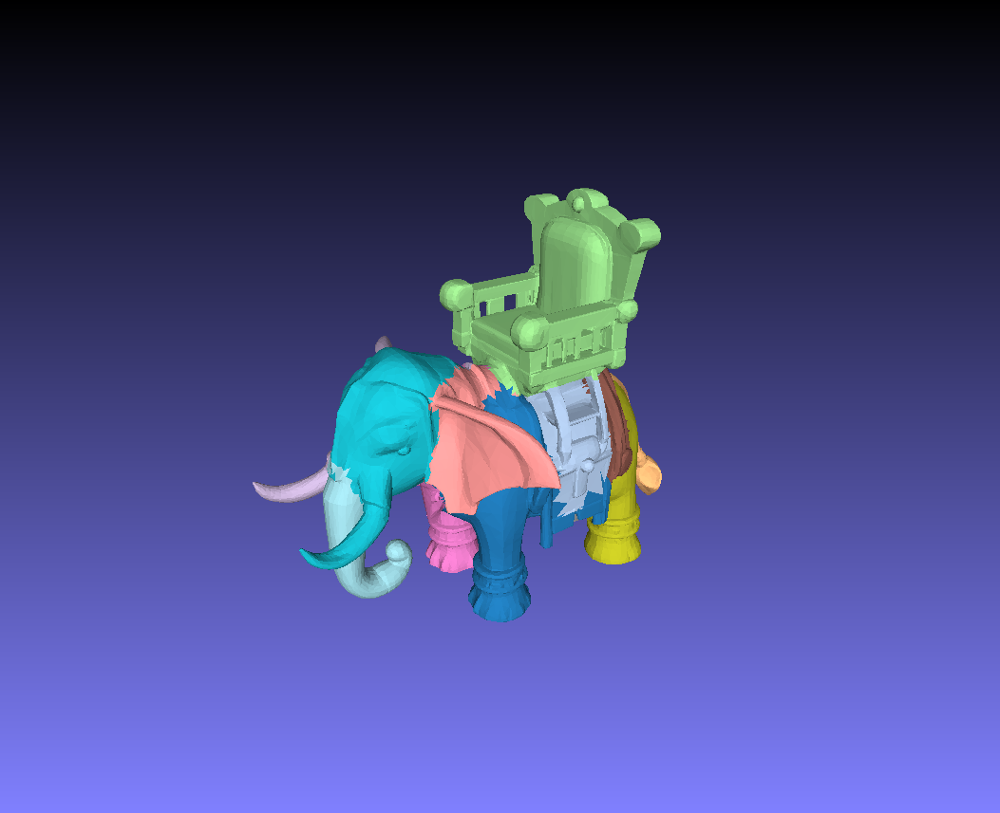
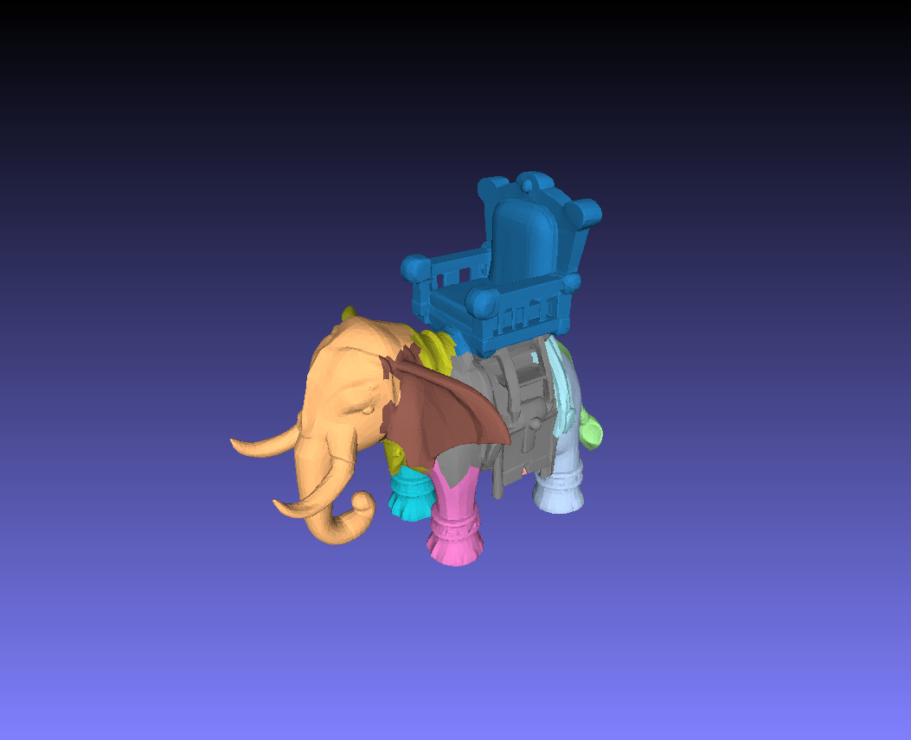
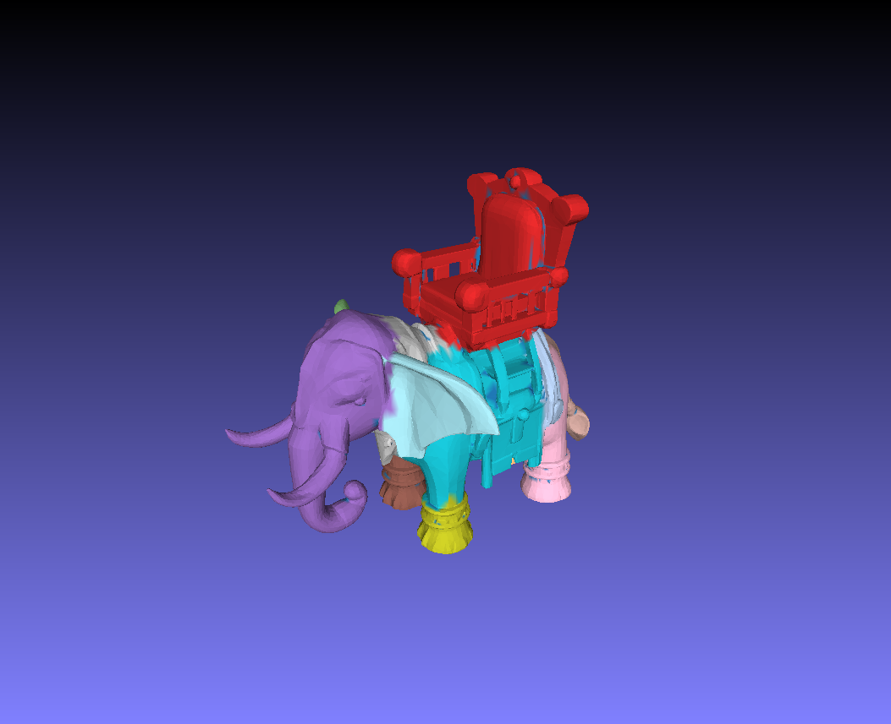

# PartField: Learning 3D Feature Fields for Part Segmentation and Beyond [ICCV 2025]
**[[Project]](https://research.nvidia.com/labs/toronto-ai/partfield-release/)** **[[PDF]](https://arxiv.org/pdf/2504.11451)**

Minghua Liu*, Mikaela Angelina Uy*, Donglai Xiang, Hao Su, Sanja Fidler, Nicholas Sharp, Jun Gao


## Overview


PartField is a feedforward model that predicts part-based feature fields for 3D shapes. Our learned features can be clustered to yield a high-quality part decomposition, outperforming the latest open-world 3D part segmentation approaches in both quality and speed. PartField can be applied to a wide variety of inputs in terms of modality, semantic class, and style. The learned feature field exhibits consistency across shapes, enabling applications such as cosegmentation, interactive selection, and correspondence.

## Table of Contents

- [Pretrained Model](#pretrained-model)
- [Environment Setup](#environment-setup)
- [TLDR](#tldr)
- [Example Run](#example-run)
  - [Download Demo Data](#download-demo-data)
  - [Extract Feature Field](#extract-feature-field)
  - [Part Segmentation](#part-segmentation)
  - [Visualization with viewer.py](#visualization-with-viewerpy)
- [Interactive Tools and Applications](#interactive-tools-and-applications)
- [Evaluation on PartObjaverse-Tiny](#evaluation-on-partobjaverse-tiny)
- [Discussion](#discussion-clustering-with-messy-mesh-connectivities)
- [Primitive Generation and Visualization](#primitive-generation-and-visualization)
- [Bounding Box Generation](#bounding-box-generation)
- [BREP CAD Output](#brep-cad-output)
  - [Boxes + Cylinders Mode](#boxes--cylinders-mode)
  - [Primitive Shapes Roadmap](#primitive-shapes-roadmap)
- [Scripts Reference](#scripts-reference)
- [Citation](#citation)


## Pretrained Model
```
mkdir model
```
The link to download our pretrained model is here: [Trained on Objaverse](https://huggingface.co/mikaelaangel/partfield-ckpt/blob/main/model_objaverse.ckpt). Due to licensing restrictions, we are unable to release the model that was also trained on PartNet.

**Mirror:** [https://huggingface.co/cad-weights/PartField](https://huggingface.co/cad-weights/PartField)

## Environment Setup

We use Python 3.10 with PyTorch 2.4 and CUDA 12.4. The environment and required packages can be installed individually as follows:
```
conda create -n partfield python=3.10
conda activate partfield
conda install nvidia/label/cuda-12.4.0::cuda
pip install psutil
pip install torch==2.4.0 torchvision==0.19.0 torchaudio==2.4.0 --index-url https://download.pytorch.org/whl/cu124
pip install lightning==2.2 h5py yacs trimesh scikit-image loguru boto3
pip install mesh2sdf tetgen pymeshlab plyfile einops libigl polyscope potpourri3d simple_parsing arrgh open3d
pip install torch-scatter -f https://data.pyg.org/whl/torch-2.4.0+cu124.html
apt install libx11-6 libgl1 libxrender1
pip install vtk
```

An environment file is also provided and can be used for installation:
```
conda env create -f environment.yml
conda activate partfield
```

## TLDR
1. Input data (`.obj` or `.glb` for meshes, `.ply` for splats) are stored in subfolders under `data/`. You can create a new subfolder and copy your custom files into it.  
2. Extract PartField features by running the script `partfield_inference.py`, passing the arguments `result_name [FEAT_FOL]` and `dataset.data_path [DATA_PATH]`. The output features will be saved in `exp_results/partfield_features/[FEAT_FOL]`.  
3. Segmented parts can be obtained by running the script `run_part_clustering.py`, using the arguments `--root exp/[FEAT_FOL]` and `--dump_dir [PART_OUT_FOL]`. The output segmentations will be saved in `exp_results/clustering/[PART_OUT_FOL]`.  
4. Application demo scripts are available in the `applications/` directory and can be used after extracting PartField features (i.e., after running `partfield_inference.py` on the desired demo data).

## Example Run
### Download Demo Data

#### Mesh Data
We showcase the feasibility of PartField using sample meshes from Objaverse (artist-created) and Trellis3D (AI-generated). Sample data can be downloaded below:
```
sh download_demo_data.sh
```
Downloaded meshes can be found in `data/objaverse_samples/` and `data/trellis_samples/`.

#### Gaussian Splats  
We also demonstrate our approach using Gaussian splatting reconstructions as input. Sample splat reconstruction data from the NeRF dataset can be found [here](https://drive.google.com/drive/folders/1l0njShLq37hn1TovgeF-PVGBBrAdNQnf?usp=sharing). Download the data and place it in the `data/splat_samples/` folder.

### Extract Feature Field 
#### Mesh Data

```
python partfield_inference.py -c configs/final/demo.yaml --opts continue_ckpt model/model_objaverse.ckpt result_name partfield_features/objaverse dataset.data_path data/objaverse_samples
python partfield_inference.py -c configs/final/demo.yaml --opts continue_ckpt model/model_objaverse.ckpt result_name partfield_features/trellis dataset.data_path data/trellis_samples 
```

#### Point Clouds / Gaussian Splats
```
python partfield_inference.py -c configs/final/demo.yaml --opts continue_ckpt model/model_objaverse.ckpt result_name partfield_features/splat dataset.data_path data/splat_samples is_pc True
```

### Part Segmentation
#### Mesh Data

We use agglomerative clustering for part segmentation on mesh inputs.
```
python run_part_clustering.py --root exp_results/partfield_features/objaverse --dump_dir exp_results/clustering/objaverse --source_dir data/objaverse_samples --use_agglo True --max_num_clusters 20 --option 0
```

When the input mesh has multiple connected components or poor connectivity, defining face adjacency by connecting geometrically close faces can yield better results (see discussion below):
```
python run_part_clustering.py --root exp_results/partfield_features/trellis --dump_dir exp_results/clustering/trellis --source_dir data/trellis_samples --use_agglo True --max_num_clusters 20 --option 1 --with_knn True
```

Note that agglomerative clustering does not return a fixed clustering result, but rather a hierarchical part tree, where the root node represents the whole shape and each leaf node corresponds to a single triangle face. You can explore more clustering results by adaptively traversing the tree, such as deciding which part should be further segmented.

#### Point Cloud / Gaussian Splats
We use K-Means clustering for part segmentation on point cloud inputs.
```
python run_part_clustering.py --root exp_results/partfield_features/splat --dump_dir exp_results/clustering/splat --source_dir data/splat_samples --max_num_clusters 20 --is_pc True
```

### Visualization with viewer.py

An interactive 3D viewer is provided to visualize segmentation results. The viewer automatically detects and loads clustering results for any input file and allows you to toggle between original and segmented views, cycle through different clustering results, and browse multiple files.

#### Basic Usage
```bash
# View a specific file with auto-detected clustering results
./run_viewer.sh data/objaverse_samples/model.glb

# View with specific clustering labels
./run_viewer.sh mesh.ply --labels exp_results/clustering/objaverse/cluster_out/labels.npy

# Browse all files in a directory
./run_viewer.sh --browse data/objaverse_samples/

# Browse generated results
./run_viewer.sh --browse exp_results/partfield_features/objaverse/
```

#### WSL2 and Software Rendering Support

For WSL2 environments or systems without GPU acceleration, use the provided shell script wrapper:

```bash
# Make the script executable (first time only)
chmod +x run_viewer.sh

# Run viewer with software rendering
./run_viewer.sh data/objaverse_samples/model.glb

# Browse mode with software rendering
./run_viewer.sh --browse data/objaverse_samples/
```

The `run_viewer.sh` script automatically configures environment variables for software rendering:
- `LIBGL_ALWAYS_SOFTWARE=1` - Forces Mesa software rendering (llvmpipe)
- `MESA_GL_VERSION_OVERRIDE=3.3` - Ensures OpenGL 3.3 compatibility
- `GALLIUM_DRIVER=llvmpipe` - Uses the llvmpipe software renderer
- Sets `DISPLAY=:0` if not already configured

All command-line arguments are passed through to `viewer.py`, so you can use any combination of options.

#### Command Line Options
| Option | Short | Description |
|--------|-------|-------------|
| `file` | | Path to mesh file (GLB, PLY, OBJ, STL, OFF, GLTF) |
| `--labels` | `-l` | Path to clustering labels NPY file (auto-detected if not specified) |
| `--browse` | `-b` | Browse mode: view all files in directory |

#### Common Usage Combinations
```bash
# View specific file with explicit labels
python viewer.py data/trellis_samples/model.glb --labels exp_results/clustering/trellis/cluster_out/model_labels.npy

# Browse directory with auto-detected results
python viewer.py --browse data/objaverse_samples/

# Browse processed results (includes clustering and PCA features)
python viewer.py --browse exp_results/partfield_features/objaverse/

# WSL2: Browse with software rendering
./run_viewer.sh --browse exp_results/clustering/objaverse/
```

<details>
<summary><b>Keyboard Shortcuts</b> (click to expand)</summary>

When you launch the viewer, a formatted help panel automatically displays in your terminal/console showing all available keyboard shortcuts. Press `H` at any time to toggle this help display.

```
╔═══════════════════════════════════════════════════════╗
║          KEYBOARD SHORTCUTS                           ║
╠═══════════════════════════════════════════════════════╣
║  T/TAB     Cycle views: Original → Segmented → PCA    ║
║  C         Next clustering (more parts)               ║
║  V         Previous clustering (fewer parts)          ║
║  A/LEFT    Previous file (browse mode)                ║
║  D/RIGHT   Next file (browse mode)                    ║
║  S         Save screenshot                            ║
║  R         Reset camera view                          ║
║  H         Toggle help panel                          ║
║  ESC/Q     Exit viewer                                ║
╚═══════════════════════════════════════════════════════╝
```

**Quick Reference:**

| Key | Action |
|-----|--------|
| `TAB` / `T` | Cycle views: Original → Segmented → PCA Features |
| `C` | Next clustering result (more parts) |
| `V` | Previous clustering result (fewer parts) |
| `LEFT` / `A` | Previous file (browse mode) |
| `RIGHT` / `D` | Next file (browse mode) |
| `S` | Save screenshot |
| `R` | Reset camera view |
| `H` | Toggle help panel (console) |
| `ESC` / `Q` | Exit viewer |

**Navigation Tips:**
- Press `T` or `TAB` to cycle between different visualization modes
- Use `C` and `V` to explore different clustering granularities (if hierarchical results exist)
- In browse mode, use `A`/`D` or arrow keys to quickly compare multiple models
- Press `H` at any time to toggle the help display in your terminal
- Press `S` to save screenshots with automatic naming based on current file and clustering

</details>

#### Features
- **Multiple View Modes**: Toggle between original mesh, segmented parts, and PCA feature visualization
- **Clustering Navigation**: Cycle through different clustering granularities (if hierarchical results exist)
- **Browse Mode**: Navigate through multiple files in a directory
- **Auto-Detection**: Automatically finds matching clustering results and PCA features in `exp_results/`
- **Screenshot Export**: Save current view as PNG image
- **Supported Formats**: GLB, GLTF, OBJ, PLY, STL, OFF

#### Example Workflow
```
# 1. Extract features
python partfield_inference.py -c configs/final/demo.yaml --opts continue_ckpt model/model_objaverse.ckpt result_name partfield_features/objaverse dataset.data_path data/objaverse_samples

# 2. Generate clustering
python run_part_clustering.py --root exp_results/partfield_features/objaverse --dump_dir exp_results/clustering/objaverse --source_dir data/objaverse_samples --use_agglo True --max_num_clusters 20 --option 0

# 3. View results interactively
python viewer.py --browse data/objaverse_samples/
```

## Interactive Tools and Applications
We include UI tools to demonstrate various applications of PartField. Set up and try out our demos [here](applications/)!





## Evaluation on PartObjaverse-Tiny


To evaluate all models in PartObjaverse-Tiny, you can download the data [here](https://github.com/Pointcept/SAMPart3D/blob/main/PartObjaverse-Tiny/PartObjaverse-Tiny.md) and run the following commands:
```
python partfield_inference.py -c configs/final/demo.yaml --opts continue_ckpt model/model_objaverse.ckpt result_name partfield_features/partobjtiny dataset.data_path data/PartObjaverse-Tiny/PartObjaverse-Tiny_mesh  n_point_per_face 2000 n_sample_each 10000
python run_part_clustering.py --root exp_results/partfield_features/partobjtiny/ --dump_dir exp_results/clustering/partobjtiny --source_dir data/PartObjaverse-Tiny/PartObjaverse-Tiny_mesh --use_agglo True --max_num_clusters 20 --option 0
```
If an OOM error occurs, you can reduce the number of points sampled per face—for example, by setting `n_point_per_face` to 500.

Evaluation metrics can be obtained by running the command below. The per-category average mIoU reported in the paper is also computed.
```
python compute_metric.py
```
This evaluation code builds on top of the implementation released by [SAMPart3D](https://github.com/Pointcept/SAMPart3D). Users with their own data and corresponding ground truths can easily modify this script to compute their metrics.

## Discussion: Clustering with Messy Mesh Connectivities
<!-- Some meshes can get messy with a lot of connected components, here the connectivity information may not be useful, causing failure cases when using Agglomerative clustering. In these cases, we provide two alternatives, 1) cluster using KMeans. We provide sample code below, or 2) converting the input mesh to a manifold surface mesh.

Sample data download:
```
cd data
mkdir messy_meshes_samples
cd messy_meshes_samples
wget https://huggingface.co/datasets/allenai/objaverse/resolve/main/glbs/000-007/00790c705e4c4a1fbc0af9bf5c9e9525.glb
wget https://huggingface.co/datasets/allenai/objaverse/resolve/main/glbs/000-132/13cc3ffc69964894a2bc94154aed687f.glb
```

Extract Partfield feature on the original mesh and run KMeans clustering:
```
python partfield_inference.py -c configs/final/demo.yaml --opts continue_ckpt model/model_objaverse.ckpt result_name partfield_features/messy_meshes_samples dataset.data_path data/messy_meshes_samples
python run_part_clustering.py --root exp_results/partfield_features/messy_meshes_samples/ --dump_dir exp_results/clustering/messy_meshes_samples_kmeans/ --source_dir data/messy_meshes_samples --max_num_clusters 20
```

Extract convert mesh into a surface manifold, extract Partfield feature and run agglomerative clustering:
```
python partfield_inference.py -c configs/final/demo.yaml --opts continue_ckpt model/model_objaverse.ckpt result_name partfield_features/messy_meshes_samples_remesh dataset.data_path data/messy_meshes_samples remesh_demo True 
python run_part_clustering_remesh.py --root exp_results/partfield_features/messy_meshes_samples_remesh --dump_dir exp_results/clustering/messy_meshes_samples_remesh --source_dir data/messy_meshes_samples --use_agglo True --max_num_clusters 20 

python run_part_clustering_remesh.py --root exp_results/partfield_features/trellis_remesh --dump_dir exp_results/clustering/trellis_remesh --source_dir data/trellis_samples --use_agglo True --max_num_clusters 20 
``` -->
 When using agglomerative clustering for part segmentation, an adjacency matrix is passed into the algorithm, which ideally requires the mesh to be a single connected component. However, some meshes can be messy, containing multiple connected components. If the input mesh is not a single connected component, we add pseudo-edges to the adjacency matrix to make it one. By default, we take a simple approach: adding `N-1` pseudo-edges as a chain to connect `N` components together. However, this approach can lead to poor results when the mesh is poorly connected and fragmented.



```
python run_part_clustering.py --root exp_results/partfield_features/trellis --dump_dir exp_results/clustering/trellis_bad --source_dir data/trellis_samples --use_agglo True --max_num_clusters 20 --option 0
```

When this occurs, we explore different options that can lead to better results:

### 1. Preprocess Input Mesh

We can perform a simple cleanup on the input meshes by removing duplicate vertices and faces, and by merging nearby vertices using `pymeshlab`. This preprocessing step can be enabled via a flag when generating PartField features:

```
python partfield_inference.py -c configs/final/demo.yaml --opts continue_ckpt model/model_objaverse.ckpt result_name partfield_features/trellis_preprocess dataset.data_path data/trellis_samples preprocess_mesh True
```

When running agglomerative clustering on a cleaned-up mesh, we observe improved part segmentation:



```
python run_part_clustering.py --root exp_results/partfield_features/trellis_preprocess --dump_dir exp_results/clustering/trellis_preprocess --source_dir data/trellis_samples --use_agglo True --max_num_clusters 20 --option 0
```

### 2. Cluster with KMeans

If modifying the input mesh is not desirable and you prefer to avoid preprocessing, an alternative is to use KMeans clustering, which does not rely on an adjacency matrix.




```
python run_part_clustering.py --root exp_results/partfield_features/trellis --dump_dir exp_results/clustering/trellis_kmeans --source_dir data/trellis_samples --max_num_clusters 20 
```

### 3. MST-based Adjacency Matrix

Instead of simply chaining the connected components of the input mesh, we also explore adding pseudo-edges to the adjacency matrix by constructing a KNN graph using face centroids and computing the minimum spanning tree of that graph.



```
python run_part_clustering.py --root exp_results/partfield_features/trellis --dump_dir exp_results/clustering/trellis_faceadj --source_dir data/trellis_samples --use_agglo True --max_num_clusters 20 --option 1 --with_knn True
```

<!-- ### Remesh with Marching Cubes (experimental)

We also explore computing the SDF of the input mesh and then running marching cubes, resulting in a surface mesh that is guaranteed to be a single connected component. We then run clustering on the new mesh and map back the segmentation labels to the original mesh by a voting scheme.



```
python partfield_inference.py -c configs/final/demo.yaml --opts continue_ckpt model/model_objaverse.ckpt result_name partfield_features/trellis_remesh dataset.data_path data/trellis_samples remesh_demo True

python run_part_clustering_remesh.py --root exp_results/partfield_features/trellis_remesh --dump_dir exp_results/clustering/trellis_remesh --source_dir data/trellis_samples --use_agglo True --max_num_clusters 20 
```-->

### More Challenging Meshes!  
The proposed approaches improve results for some meshes, but we find that certain cases still do not produce satisfactory segmentations. We leave these challenges for future work. If you're interested, here are some examples of difficult meshes we encountered:

**Challenging Meshes:**
```
cd data
mkdir challenge_samples
cd challenge_samples
wget https://huggingface.co/datasets/allenai/objaverse/resolve/main/glbs/000-007/00790c705e4c4a1fbc0af9bf5c9e9525.glb
wget https://huggingface.co/datasets/allenai/objaverse/resolve/main/glbs/000-132/13cc3ffc69964894a2bc94154aed687f.glb
```

## Citation
```
@inproceedings{partfield2025,
      title={PartField: Learning 3D Feature Fields for Part Segmentation and Beyond}, 
      author={Minghua Liu and Mikaela Angelina Uy and Donglai Xiang and Hao Su and Sanja Fidler and Nicholas Sharp and Jun Gao},
      year={2025}
}
```

## Primitive Generation and Visualization

PartField includes tools for generating geometric primitives from segmented meshes and visualizing the results. These tools provide additional functionality for analyzing and understanding the generated part segments.

### Primitive Generation

The `segment_with_primitives.py` script fits geometric primitives to each segment of a segmented mesh, providing a more abstract and structured representation of the parts.

#### Supported Primitive Types
- Basic shapes: Box, Cylinder, Sphere, Ellipsoid
- Partial spheres: Hemisphere, Quarter sphere, Eighth sphere
- Other primitives: Cone, Capsule, Triangular prism
- Platonic solids: Tetrahedron, Octahedron
- Fallback: Oriented bounding box (when no good fit is found)

#### Usage
```bash
# Basic usage with input mesh and segmentation labels
python segment_with_primitives.py -i input_mesh.glb -l segmentation_labels.npy -o output.ply

# Adjust fit threshold (lower values = more accurate fit required)
python segment_with_primitives.py -i input_mesh.glb -l segmentation_labels.npy -o output.ply -t 0.3

# Use vertex labels instead of face labels
python segment_with_primitives.py -i input_mesh.glb -l vertex_labels.npy -o output.ply --vertex-labels
```

#### Output Files
The script generates three output files:
- `output.ply`: Combined visualization with original mesh and primitives
- `output_primitives_only.ply`: Only the fitted primitives
- `output_info.txt`: Detailed information about primitive types, dimensions, and fit quality

#### Example
```bash
# Process a segmented mesh from PartField clustering
python segment_with_primitives.py -i data/objaverse_samples/model.glb -l exp_results/clustering/objaverse/cluster_out/model_labels.npy -o test_output_primitives.ply
```

### Enhanced Visualization

The repository includes a specialized 3D viewer (`viewer.py`) for visualizing meshes, segmentations, and primitives with interactive controls.

#### Features
- Toggle between original mesh, segmentation, and PCA feature views
- Cycle through different clustering granularities
- Browse multiple files in a directory
- Software rendering support for WSL2/headless environments

#### Usage
```bash
# View a specific file with auto-detected clustering results
python viewer.py data/objaverse_samples/model.glb

# View with explicit labels file
python viewer.py mesh.ply --labels exp_results/clustering/objaverse/cluster_out/model_labels.npy

# Browse all files in a directory
python viewer.py --browse data/objaverse_samples/

# Use software rendering (for WSL2/headless environments)
./run_viewer.sh data/objaverse_samples/model.glb
```

#### Keyboard Controls
| Key | Action |
|-----|--------|
| `TAB` / `T` | Cycle views: Original → Segmented → PCA Features |
| `C` | Next clustering result (more parts) |
| `V` | Previous clustering result (fewer parts) |
| `LEFT` / `A` | Previous file (browse mode) |
| `RIGHT` / `D` | Next file (browse mode) |
| `S` | Save screenshot |
| `R` | Reset camera view |
| `H` | Toggle help panel (console) |
| `ESC` / `Q` | Exit viewer |

#### Example Workflow
```bash
# 1. Extract features
python partfield_inference.py -c configs/final/demo.yaml --opts continue_ckpt model/model_objaverse.ckpt result_name partfield_features/objaverse dataset.data_path data/objaverse_samples

# 2. Generate clustering
python run_part_clustering.py --root exp_results/partfield_features/objaverse --dump_dir exp_results/clustering/objaverse --source_dir data/objaverse_samples --use_agglo True --max_num_clusters 20 --option 0

# 3. Generate primitives for segments
python segment_with_primitives.py -i data/objaverse_samples/model.glb -l exp_results/clustering/objaverse/cluster_out/model_labels.npy -o test_output_primitives.ply

# 4. View results with interactive viewer
python viewer.py test_output_primitives.ply
```

## Bounding Box Generation

The `segment_with_bboxes.py` script generates oriented bounding boxes (OBBs) for each segment of a segmented mesh. This provides a lightweight geometric representation of parts, useful for collision detection, spatial analysis, and visualization.

### Features
- **Intelligent Point Filtering**: Automatically removes outliers and low-density points for cleaner boxes
  - Statistical outlier removal using IQR method
  - Density-based filtering using KNN local density estimation
  - Off-angle protrusion removal for capturing the "main body" of each segment
- **PCA-based Orientation**: Boxes are aligned to principal components for optimal fit
- **Automatic Overlap Resolution**: Iteratively shrinks overlapping boxes until no intersections remain
- Supports three rendering styles: solid, wireframe, and transparent
- Generates all styles simultaneously with `--style all`
- Exports detailed info file with center, dimensions, and rotation matrix

### Usage
```bash
# Generate all three styles with filtering and overlap resolution (default)
python segment_with_bboxes.py -i model.glb -l labels.npy -o output.ply --style all

# Generate wireframe boxes (edge-only visualization)
python segment_with_bboxes.py -i model.glb -l labels.npy -o output.ply --style wireframe

# Disable filtering for raw bounding boxes (captures all geometry including outliers)
python segment_with_bboxes.py -i model.glb -l labels.npy -o output.ply --no-filter

# Disable overlap resolution (boxes may intersect)
python segment_with_bboxes.py -i model.glb -l labels.npy -o output.ply --no-overlap-resolution

# Use vertex labels instead of face labels
python segment_with_bboxes.py -i model.glb -l vertex_labels.npy -o output.ply --vertex-labels
```

### Command Line Options
| Option | Short | Description |
|--------|-------|-------------|
| `--input` | `-i` | Input mesh file (GLB, PLY, OBJ, etc.) |
| `--labels` | `-l` | Segmentation labels NPY file |
| `--output` | `-o` | Output file path |
| `--style` | `-s` | Box style: `solid`, `wireframe`, `transparent`, or `all` (default: `all`) |
| `--vertex-labels` | | Treat labels as per-vertex (default: per-face) |
| `--no-filter` | | Disable outlier/density filtering |
| `--no-overlap-resolution` | | Disable automatic overlap resolution |

### Output Files

When using `--style all` (default):
```
output_solid.ply        # Opaque colored boxes
output_wireframe.ply    # Edge-only boxes (thin cylinders)
output_transparent.ply  # Semi-transparent boxes (60% opacity)
output_info.txt         # Segment info (center, dimensions, rotation)
```

When using a single style:
```
output.ply              # Boxes in selected style
output_info.txt         # Segment info
```

### Example Workflow
```bash
# 1. Extract features
python partfield_inference.py -c configs/final/demo.yaml \
    --opts continue_ckpt model/model_objaverse.ckpt \
    result_name partfield_features/glb_output \
    dataset.data_path data/glb_output

# 2. Generate clustering
python run_part_clustering.py \
    --root exp_results/partfield_features/glb_output \
    --dump_dir exp_results/clustering/glb_output \
    --source_dir data/glb_output \
    --use_agglo True --max_num_clusters 20 --option 0

# 3. Generate bounding boxes for each segment
python segment_with_bboxes.py \
    -i data/glb_output/van_model.glb \
    -l exp_results/clustering/glb_output/cluster_out/van_model_0_10.npy \
    -o exp_results/bboxes/glb_output/van_model_bboxes.ply \
    --style all

# 4. View results
./run_viewer.sh exp_results/bboxes/glb_output/van_model_bboxes_solid.ply
./run_viewer.sh --browse exp_results/bboxes/glb_output/
```

### Info File Format
The generated `_info.txt` file contains detailed information for each segment:
```
Segment Bounding Box Results
==================================================

Segment 0.0:
  Center: [x, y, z]
  Dimensions: [width, height, depth]
  Rotation Matrix:
    [r00, r01, r02]
    [r10, r11, r12]
    [r20, r21, r22]

Segment 1.0:
  ...
```

### Global-Oriented Bounding Boxes

For models where you want all bounding boxes to share the same orientation (aligned to the model's principal axes), use `segment_with_bboxes_global.py`:

```bash
# Generate globally-oriented bounding boxes
python segment_with_bboxes_global.py \
    -i data/glb_output/model.glb \
    -l exp_results/clustering/glb_output/cluster_out/model_0_10.npy \
    -o exp_results/bboxes/glb_output/model_bboxes_global.ply \
    --style all
```

**When to use global orientation:**
- CAD models with consistent part orientations
- Architectural models where alignment matters
- Models where visual consistency of boxes is desired

**When to use per-segment orientation (`segment_with_bboxes.py`):**
- Organic models with parts at various angles
- When you want the tightest possible fit per segment

#### Global BBox Command Line Options

| Option | Short | Description |
|--------|-------|-------------|
| `--input` | `-i` | Input mesh file (GLB, PLY, OBJ, etc.) |
| `--labels` | `-l` | Segmentation labels NPY file |
| `--output` | `-o` | Output file path |
| `--style` | `-s` | Box style: `solid`, `wireframe`, `transparent`, or `all` (default: `all`) |
| `--method` | `-m` | Orientation method: `all_vertices` (default) or `single_box` |
| `--vertex-labels` | | Treat labels as per-vertex (default: per-face) |
| `--no-filter` | | Disable outlier/density filtering |
| `--no-overlap-resolution` | | Disable automatic overlap resolution |

#### Comparing Both Approaches

```bash
# Generate per-segment oriented boxes (tighter fit)
python segment_with_bboxes.py \
    -i data/glb_output/model.glb \
    -l exp_results/clustering/glb_output/cluster_out/model_0_10.npy \
    -o exp_results/bboxes/glb_output/model_bboxes_local.ply --style all

# Generate globally-oriented boxes (consistent alignment)
python segment_with_bboxes_global.py \
    -i data/glb_output/model.glb \
    -l exp_results/clustering/glb_output/cluster_out/model_0_10.npy \
    -o exp_results/bboxes/glb_output/model_bboxes_global.ply --style all

# View both results
./run_viewer.sh exp_results/bboxes/glb_output/model_bboxes_local_solid.ply
./run_viewer.sh exp_results/bboxes/glb_output/model_bboxes_global_solid.ply
```

---

## BREP CAD Output

PartField can generate **real CAD files (STEP format)** from segmentation results using pythonOCC's BREP (Boundary Representation) API. This produces parametric solid geometry viewable in any CAD tool (FreeCAD, SolidWorks, CATIA, etc.).

### Requirements

```bash
# Install pythonocc-core (required for BREP generation)
conda install -c conda-forge pythonocc-core

# PyQt5 is needed for the BREP viewer (usually already installed)
pip install PyQt5
```

### Quick Start

```bash
# STEP → STEP: Full pipeline from a CAD file to bounding-box CAD file
./run_step_to_brep.sh -i model.step -o model_bboxes.step
python step_to_brep.py -i model.step -o model_bboxes.step --clusters 5
python step_to_brep.py -i model.step -o model_bboxes.step --alignment global

# STEP → STEP with smart box/cylinder selection
./run_step_to_brep_cylinder.sh -i model.step -o model_bbox_cyl.step
python step_to_brep.py -i model.step -o model_bbox_cyl.step --mode bbox_cylinder

# Generate BREP from mesh + labels (manual pipeline)
python brep_generator.py -i model.glb -l labels.npy -o result.step --mode bbox
python brep_generator.py -i model.glb -l labels.npy -o result.step --mode bbox_cylinder
python brep_generator.py -i model.glb -l labels.npy -o result.step --mode primitive

# View BREP in interactive viewer
./run_brep_viewer.sh result.step
./run_brep_viewer.sh --browse exp_results/brep/

# On-the-fly: generate + view
python brep_viewer.py --mesh model.glb --labels labels.npy

# Add --brep flag to existing scripts
python segment_with_bboxes.py -i model.glb -l labels.npy -o output.ply --brep
python segment_with_primitives.py -i model.glb -l labels.npy -o output.ply --brep
```

### Pipeline Variants

| Variant | Script | Clusters | Alignment | Output |
|---------|--------|----------|-----------|--------|
| 1 | `pipeline_variant1_auto_self.sh` | Auto 2-50 | Self | PLY |
| 2 | `pipeline_variant2_auto_global.sh` | Auto 2-50 | Global | PLY |
| 3 | `pipeline_variant3_fixed5_self.sh` | Fixed 5 | Self | PLY |
| 4 | `pipeline_variant4_fixed5_global.sh` | Fixed 5 | Global | PLY |
| **5** | `pipeline_variant5_auto_self_brep.sh` | Auto 2-50 | Self | **STEP** |
| **6** | `pipeline_variant6_auto_global_brep.sh` | Auto 2-50 | Global | **STEP** |
| **7** | `pipeline_variant7_fixed5_self_brep.sh` | Fixed 5 | Self | **STEP** |
| **8** | `pipeline_variant8_fixed5_global_brep.sh` | Fixed 5 | Global | **STEP** |

Variants 5-8 produce STEP files using the same PartField features and clustering as variants 1-4, but convert the bounding box metadata directly to BREP solid geometry instead of triangulated mesh approximations.

### Viewers

| Viewer | Backend | Formats | Script |
|--------|---------|---------|--------|
| Open3D Viewer | `viewer.py` + `run_viewer.sh` | PLY, GLB, OBJ | Mesh-based |
| BREP Viewer | `brep_viewer.py` + `run_brep_viewer.sh` | STEP, STP | CAD solid |

See [VIEWER.md](VIEWER.md) for detailed viewer documentation and [SCRIPTS.md](SCRIPTS.md) for the full pipeline reference.

### Boxes + Cylinders Mode

The `bbox_cylinder` mode intelligently selects between oriented bounding boxes and circumscribed cylinders for each segment. It analyzes the cross-section circularity of each bounding box along all three axes:

- **Circular cross-section** (score > 0.5) → cylinder, oriented along that axis
- **Rectangular cross-section** → standard bounding box

This produces results that match the original geometry more closely: pipes and rods become cylinders, flat panels stay as boxes, rocket bodies get short fat cylinders, etc.

```bash
# End-to-end with wrapper script (includes dependency checks + viewer)
./run_step_to_brep_cylinder.sh -i model.step -o model_bbox_cyl.step

# Or directly via step_to_brep.py
python step_to_brep.py -i model.step -o model_bbox_cyl.step --mode bbox_cylinder

# Batch mode
./run_step_to_brep_cylinder.sh --input-dir steps/ --output-dir brep_cyl_out/

# Standalone from mesh + labels
python brep_generator.py -i model.glb -l labels.npy -o result.step --mode bbox_cylinder

# View results
./run_brep_viewer.sh model_bbox_cyl.step
./run_brep_viewer.sh --browse exp_results/brep/
```

The cylinder's radius circumscribes the bounding box's cross-section ("circles the square"), and its height matches the extent along the chosen axis. Each segment gets exactly one shape — the one that best matches the original BREP section's geometry.

### Primitive Shapes Roadmap

The cylinder mode is the first step in a broader plan to derive geometric primitives from bounding box geometry. See [PRIMITIVE_SHAPES_ROADMAP.md](PRIMITIVE_SHAPES_ROADMAP.md) for the full roadmap covering:

- **Sphere** — from near-cubic bounding boxes
- **Capsule** — elongated cylinders with hemispherical caps
- **Cone** — tapered segments with varying cross-section density
- **Ellipsoid** — three distinct, non-extreme aspect ratios
- **Hemisphere** — dome-like segments

Each primitive follows the same architecture: analyze the bounding box geometry, derive shape parameters, and use the existing `BRepShapeBuilder.make_*()` methods for CAD-quality STEP output.

---

## Scripts Reference

### Overview Table

| Script | Description |
|--------|-------------|
| `partfield_inference.py` | Extract PartField features from 3D meshes |
| `run_part_clustering.py` | Generate part segmentation using clustering |
| `segment_with_primitives.py` | Fit geometric primitives (box, cylinder, sphere, etc.) to segments |
| `segment_with_bboxes.py` | Generate per-segment oriented bounding boxes |
| `segment_with_bboxes_global.py` | Generate globally-oriented bounding boxes (consistent alignment) |
| `viewer.py` | Interactive 3D viewer for visualization |
| `run_viewer.sh` | Wrapper script for viewer with WSL2/software rendering support |
| `step_to_brep.py` | End-to-end STEP → STEP pipeline (tessellate, segment, generate BREP bboxes) |
| `brep_generator.py` | Generate BREP CAD files (STEP) from segmentation results |
| `brep_viewer.py` | Interactive Qt+pythonOCC viewer for STEP files |
| `run_brep_viewer.sh` | Wrapper script for BREP viewer with WSL2/Qt support |
| `run_step_to_brep.sh` | Wrapper script for STEP→BREP bbox pipeline with dependency checks + viewer |
| `run_step_to_brep_cylinder.sh` | Wrapper script for STEP→BREP box+cylinder pipeline with dependency checks + viewer |
| `process_obj_batch.py` | Batch processing pipeline for OBJ files |
| `compute_metric.py` | Evaluation metrics computation |

---

### partfield_inference.py

Extracts PartField features from 3D meshes or point clouds.

```bash
# Basic usage for mesh data
python partfield_inference.py -c configs/final/demo.yaml \
    --opts continue_ckpt model/model_objaverse.ckpt \
    result_name partfield_features/[NAME] \
    dataset.data_path data/[INPUT_DIR]

# For point clouds / Gaussian splats
python partfield_inference.py -c configs/final/demo.yaml \
    --opts continue_ckpt model/model_objaverse.ckpt \
    result_name partfield_features/[NAME] \
    dataset.data_path data/[INPUT_DIR] \
    is_pc True

# With mesh preprocessing (cleanup)
python partfield_inference.py -c configs/final/demo.yaml \
    --opts continue_ckpt model/model_objaverse.ckpt \
    result_name partfield_features/[NAME] \
    dataset.data_path data/[INPUT_DIR] \
    preprocess_mesh True
```

**Output:** `exp_results/partfield_features/[NAME]/`
- `input_*.ply` - Processed input mesh
- `feat_pca_*.ply` - PCA-colored feature visualization

---

### run_part_clustering.py

Generates part segmentation from extracted features using clustering.

```bash
# Agglomerative clustering (recommended for meshes)
python run_part_clustering.py \
    --root exp_results/partfield_features/[NAME] \
    --dump_dir exp_results/clustering/[NAME] \
    --source_dir data/[INPUT_DIR] \
    --use_agglo True \
    --max_num_clusters 20 \
    --option 0

# With KNN for messy meshes
python run_part_clustering.py \
    --root exp_results/partfield_features/[NAME] \
    --dump_dir exp_results/clustering/[NAME] \
    --source_dir data/[INPUT_DIR] \
    --use_agglo True \
    --max_num_clusters 20 \
    --option 1 \
    --with_knn True

# KMeans clustering (for point clouds)
python run_part_clustering.py \
    --root exp_results/partfield_features/[NAME] \
    --dump_dir exp_results/clustering/[NAME] \
    --source_dir data/[INPUT_DIR] \
    --max_num_clusters 20 \
    --is_pc True
```

**Options:**
| Option | Description |
|--------|-------------|
| `--root` | Path to extracted features |
| `--dump_dir` | Output directory for clustering results |
| `--source_dir` | Original input data directory |
| `--use_agglo` | Use agglomerative clustering (True/False) |
| `--max_num_clusters` | Maximum number of clusters |
| `--option` | Adjacency option (0=chain, 1=MST-based) |
| `--with_knn` | Use KNN for adjacency (True/False) |
| `--is_pc` | Input is point cloud (True/False) |

**Output:** `exp_results/clustering/[NAME]/`
- `cluster_out/*.npy` - Segmentation labels for each cluster count
- `ply/*.ply` - Colored segmentation visualizations

---

### segment_with_primitives.py

Fits geometric primitives to each segment of a segmented mesh.

```bash
# Basic usage
python segment_with_primitives.py \
    -i [MESH_FILE] \
    -l [LABELS_FILE] \
    -o [OUTPUT.ply]

# With custom threshold
python segment_with_primitives.py \
    -i [MESH_FILE] \
    -l [LABELS_FILE] \
    -o [OUTPUT.ply] \
    --threshold 0.3

# Vertex labels instead of face labels
python segment_with_primitives.py \
    -i [MESH_FILE] \
    -l [LABELS_FILE] \
    -o [OUTPUT.ply] \
    --vertex-labels
```

**Options:**
| Option | Short | Description |
|--------|-------|-------------|
| `--input` | `-i` | Input mesh file |
| `--labels` | `-l` | Segmentation labels NPY file |
| `--output` | `-o` | Output file path |
| `--threshold` | `-t` | Fit score threshold (default: 0.35) |
| `--vertex-labels` | | Use vertex labels instead of face labels |
| `--no-primitives-separate` | | Don't export primitives-only file |

**Supported Primitives:**
- Box, Cylinder, Sphere, Ellipsoid
- Hemisphere, Quarter sphere, Eighth sphere
- Cone, Capsule, Triangular prism
- Tetrahedron, Octahedron
- Oriented bounding box (fallback)

**Output:**
- `output.ply` - Combined mesh with primitives overlay
- `output_primitives_only.ply` - Only the fitted primitives
- `output_info.txt` - Primitive types, dimensions, fit scores

---

### segment_with_bboxes.py

Generates oriented bounding boxes (OBBs) for each segment with intelligent filtering and overlap resolution.

```bash
# Generate all styles with filtering (default)
python segment_with_bboxes.py \
    -i [MESH_FILE] \
    -l [LABELS_FILE] \
    -o [OUTPUT.ply] \
    --style all

# Generate wireframe only
python segment_with_bboxes.py \
    -i [MESH_FILE] \
    -l [LABELS_FILE] \
    -o [OUTPUT.ply] \
    --style wireframe

# Disable filtering for raw boxes
python segment_with_bboxes.py \
    -i [MESH_FILE] \
    -l [LABELS_FILE] \
    -o [OUTPUT.ply] \
    --no-filter
```

**Options:**
| Option | Short | Description |
|--------|-------|-------------|
| `--input` | `-i` | Input mesh file |
| `--labels` | `-l` | Segmentation labels NPY file |
| `--output` | `-o` | Output file path |
| `--style` | `-s` | `solid`, `wireframe`, `transparent`, or `all` |
| `--vertex-labels` | | Use vertex labels instead of face labels |
| `--no-filter` | | Disable outlier/density filtering |
| `--no-overlap-resolution` | | Disable automatic overlap resolution |

**Features:**
- **Point Filtering**: Removes outliers and sparse points using IQR + KNN density estimation
- **PCA Orientation**: Aligns boxes to principal components for optimal fit
- **Overlap Resolution**: Automatically shrinks overlapping boxes to eliminate intersections

**Output (with `--style all`):**
- `output_solid.ply` - Opaque colored boxes
- `output_wireframe.ply` - Edge-only wireframe boxes
- `output_transparent.ply` - Semi-transparent boxes (60% opacity)
- `output_info.txt` - Center, dimensions, rotation for each box

---

### viewer.py / run_viewer.sh

Interactive 3D viewer for visualization.

```bash
# Direct Python usage
python viewer.py [FILE.ply]
python viewer.py [FILE.glb] --labels [LABELS.npy]
python viewer.py --browse [DIRECTORY]

# With software rendering (WSL2/headless)
./run_viewer.sh [FILE.ply]
./run_viewer.sh --browse [DIRECTORY]
```

**Options:**
| Option | Short | Description |
|--------|-------|-------------|
| `file` | | Path to mesh file |
| `--labels` | `-l` | Path to clustering labels NPY file |
| `--browse` | `-b` | Browse all files in directory |

**Keyboard Controls:**
| Key | Action |
|-----|--------|
| `TAB` / `T` | Cycle views: Original → Segmented → PCA |
| `C` | Next clustering (more parts) |
| `V` | Previous clustering (fewer parts) |
| `A` / `LEFT` | Previous file (browse mode) |
| `D` / `RIGHT` | Next file (browse mode) |
| `S` | Save screenshot |
| `R` | Reset camera view |
| `H` | Toggle help panel |
| `ESC` / `Q` | Exit viewer |

---

### process_obj_batch.py

Automated batch processing pipeline for OBJ files.

```bash
# Basic processing
python process_obj_batch.py \
    --input-dir data/[INPUT_DIR] \
    --name [NAME]

# With primitive fitting
python process_obj_batch.py \
    --input-dir data/[INPUT_DIR] \
    --name [NAME] \
    --fit-primitives

# Custom parameters
python process_obj_batch.py \
    --input-dir data/[INPUT_DIR] \
    --name [NAME] \
    --max-clusters 15 \
    --num-cluster-targets 8 \
    --primitive-threshold 0.3
```

**Options:**
| Option | Short | Description |
|--------|-------|-------------|
| `--input-dir` | `-i` | Input directory with OBJ files |
| `--name` | `-n` | Name for this processing run |
| `--max-clusters` | | Maximum clusters (default: 20) |
| `--fit-primitives` | | Fit geometric primitives |
| `--num-cluster-targets` | | Cluster count for primitives (default: 10) |
| `--primitive-threshold` | | Fit threshold (default: 0.35) |
| `--quiet` | `-q` | Suppress progress messages |

**Pipeline Steps:**
1. Organize files into flat structure
2. Extract PartField features
3. Run part clustering
4. Fit geometric primitives (optional)

---

## Complete Processing Workflows

### Workflow 1: Basic Mesh Segmentation
```bash
# 1. Extract features
python partfield_inference.py -c configs/final/demo.yaml \
    --opts continue_ckpt model/model_objaverse.ckpt \
    result_name partfield_features/my_data \
    dataset.data_path data/my_meshes

# 2. Generate clustering
python run_part_clustering.py \
    --root exp_results/partfield_features/my_data \
    --dump_dir exp_results/clustering/my_data \
    --source_dir data/my_meshes \
    --use_agglo True --max_num_clusters 20

# 3. View results
./run_viewer.sh --browse exp_results/clustering/my_data/ply/
```

### Workflow 2: With Primitives
```bash
# After steps 1-2 above...

# 3. Fit primitives
python segment_with_primitives.py \
    -i data/my_meshes/model.glb \
    -l exp_results/clustering/my_data/cluster_out/model_0_10.npy \
    -o exp_results/primitives/model_primitives.ply

# 4. View results
./run_viewer.sh exp_results/primitives/model_primitives.ply
```

### Workflow 3: With Bounding Boxes
```bash
# After steps 1-2 above...

# 3. Generate bounding boxes
python segment_with_bboxes.py \
    -i data/my_meshes/model.glb \
    -l exp_results/clustering/my_data/cluster_out/model_0_10.npy \
    -o exp_results/bboxes/my_data/model_bboxes.ply \
    --style all

# 4. View different styles
./run_viewer.sh exp_results/bboxes/my_data/model_bboxes_solid.ply
./run_viewer.sh exp_results/bboxes/my_data/model_bboxes_wireframe.ply
./run_viewer.sh exp_results/bboxes/my_data/model_bboxes_transparent.ply
```

### Workflow 4: Batch Processing
```bash
# Single command for complete pipeline
python process_obj_batch.py \
    --input-dir data/my_obj_files \
    --name batch_run \
    --fit-primitives

# View results
./run_viewer.sh --browse exp_results/clustering/batch_run_flat/ply/
```

### Workflow 5: STEP → BREP Bounding Boxes
```bash
# End-to-end from a CAD STEP file to segmented BREP
./run_step_to_brep.sh -i data/stepfiles/model.step -o exp_results/brep/model_bboxes.step

# View original vs generated
./run_brep_viewer.sh --visualize data/stepfiles/model.step exp_results/brep/model_bboxes.step
```

### Workflow 6: STEP → BREP Boxes + Cylinders
```bash
# Smart box/cylinder selection per segment
./run_step_to_brep_cylinder.sh -i data/stepfiles/model.step -o exp_results/brep/model_bbox_cyl.step

# View results
./run_brep_viewer.sh exp_results/brep/model_bbox_cyl.step

# Batch processing
./run_step_to_brep_cylinder.sh --input-dir data/stepfiles/ --output-dir exp_results/brep/cylinders/
```

---

## Directory Structure

```
PartField/
├── data/                          # Input data
│   ├── objaverse_samples/         # Sample meshes
│   ├── glb_output/                # GLB format meshes
│   └── ...
├── exp_results/                   # Output results
│   ├── partfield_features/        # Extracted features
│   │   └── [name]/
│   │       ├── input_*.ply
│   │       └── feat_pca_*.ply
│   ├── clustering/                # Segmentation results
│   │   └── [name]/
│   │       ├── cluster_out/*.npy  # Label files
│   │       └── ply/*.ply          # Visualization
│   ├── bboxes/                    # Bounding box outputs
│   │   └── [name]/
│   │       ├── *_solid.ply
│   │       ├── *_wireframe.ply
│   │       ├── *_transparent.ply
│   │       └── *_info.txt
│   ├── primitives/                # Primitive fitting outputs
│   └── brep/                      # BREP STEP outputs (boxes, cylinders)
├── model/                         # Pretrained model
│   └── model_objaverse.ckpt
└── configs/                       # Configuration files
```

---

## References
PartField borrows code from the following repositories:
- [OpenLRM](https://github.com/3DTopia/OpenLRM)
- [PyTorch 3D UNet](https://github.com/wolny/pytorch-3dunet)
- [PVCNN](https://github.com/mit-han-lab/pvcnn)
- [SAMPart3D](https://github.com/Pointcept/SAMPart3D) — evaluation script

Many thanks to the authors for sharing their code!
